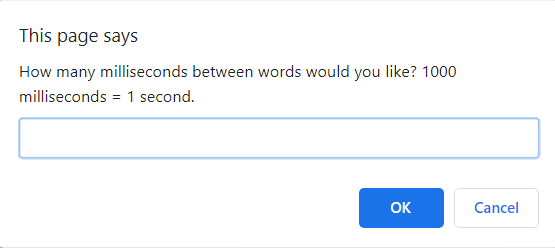
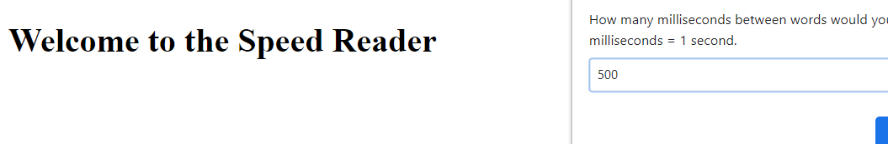
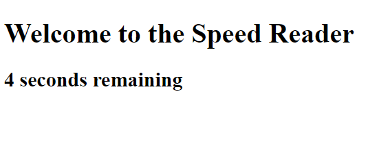
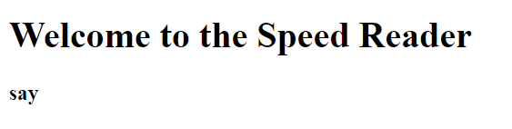

# JS-Speed-Reader

JavaScript Speed Reader

<!-- Live link to deployed app -->

Repository: https://github.com/Mdudzik92/JS-Speed-Reader 
Deployed app: https://mdudzik92.github.io/js-speed-reader/

<!-- Technologies used -->

JavaScript, HTML, DOM Manipulation

<!-- Explanation of what the app is -->

This is a speed reader app created with JavaScript using DOM Manipulation to access and write to a blank HTML file. The user opens the page and chooses how many seconds between words they would like to test their speed reading skills with, letting them know they need to choose in milliseconds. They watch as the time counter decrements by one second at a time until each word of a specific poem is then printed to the screen at the time interval they picked.

<!-- Screenshot -->

<!-- License -->

MIT

<!-- Contact information -->

Email: mdudzik92@gmail.com
